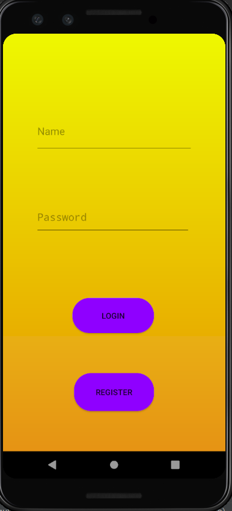
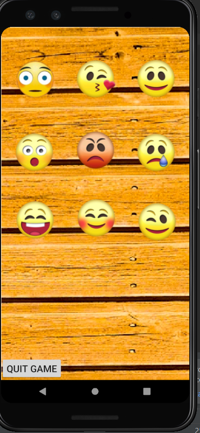
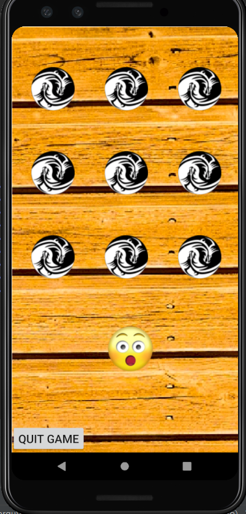
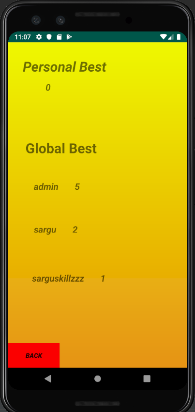
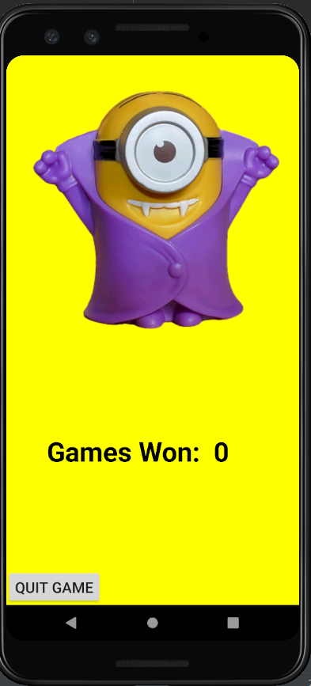

# Memory game

This game was designed using android studio and the primary task of the game is to test the players memory. The login screen uses firebase to store the data entered which helps keep the information safe and common to all users. Firstly nine emojis appear on the screen and stay for a couple of seconds. After this they all dispear and one of those emojis appear again. The player must touch the location the emoji was in to gain a point. The game keeps track of all high scores globally. 
The main code was written in java with features such as firebase in it and some xml.   

**LOGIN SCREEN:**  
  

**GAME SCREENS:**  

  

**END SCREEN:**  
  

